# LauncherSPO

Заполнение электронного журнала, отметка явки, выставление оценки

За основу взят [Eljurnal](https://github.com/ChePchik/Eljurnal)

## Установка для пользователей

1. (Инструкция по установке будет добавлена в ближайшее время...)

## Установка для разработчиков

1. Скачиваем и устанавливаем [Python 3.10](https://www.python.org/downloads/release/python-3109/) (лучше) или 3.9.
2. Скачать проект любым способом. Перейдите в папку проекта.
3. Откройте командную строку (терминал) в папке проекта.
4. Введите следующую команду для установки необходимых зависимостей: `pip install -r requirements.txt`.

Если нет ни каких ошибок - то можно продолжать дальше

# Инструкция использования

## 1. Запуск

Запускаем `LuncherSPO.exe` или `GUI.py`

Вам будет предложено окно авторизации.

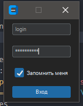

Введите свои учетные данные от электронного журнала. Если вы хотите сохранить данные для будущего использования, отметьте `"Запомнить меня"`.

При первом запуске приложения может потребоваться некоторое время на загрузку и сохранение ваших групп. В последующем запуске процесс будет более быстрым.

## 2. Выбор действий

После успешной авторизации откроется главное меню с выбором различных действий. Рассмотрим каждый из них.

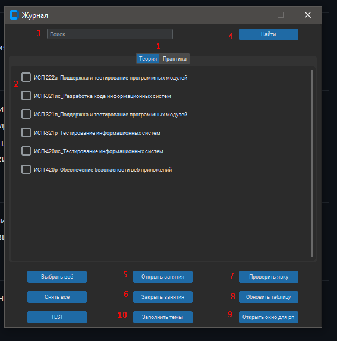

### 1. Выбор теории или практики

При выборе вкладки "Теория" или "Практика" будут отображены соответствующие группы. Отличие между теорией и практикой заключается в номере подгруппы, указанном в имени группы.

### 2. Выбор группы и предмета

Есть возможность выбора одной или нескольких групп. О действиях, которые можно выполнять при выборе групп, смотрите в соответствующих разделах.

### 3. Панель поиска

Поиск осуществляется по ключевым словам, таким как номер курса или название группы.

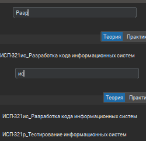

### 4. Кнопка найти

После ввода ключевых слов нажмите эту кнопку или клавишу Enter, чтобы выполнить поиск.

### 5. Открыть занятие и Закрыть занятие

Вы можете выбрать несколько групп для данного действия.

Процесс загрузки будет отображен.

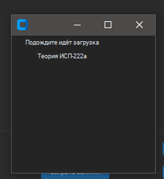

И сам результат

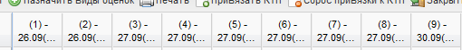

### 7. Проверить явку

В поле поиска можно ввести "Сегодня", чтобы отобразить группы на текущую дату.

После нажатия кнопки откроется календарь.

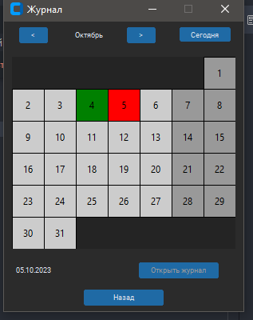

Прошлые занятия будут выделены зеленым цветом, а текущий день - красным.

Выберите определенный день, чтобы открыть журнал. Откроется новое окно.

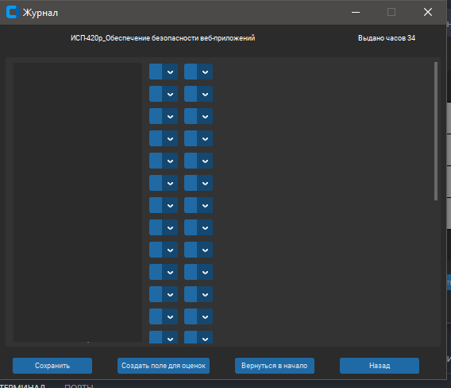

В правом верхнем углу будет подсчитано количество пройденных пар.

Среди оценок можно отметить явку, выбрав первую явку, остальные заполнятся автоматически. Это удобно, когда на одного человека приходится несколько пар.Очень удобно когда стоит 6 пар и на каждого человека не надо кликать по 6 раз.

Также есть кнопка `Создать поле для оценок`. Для одной пары можно создать только одну оценку, даже если у вас несколько пар. Обратите внимание на это ограничение.

Ещё ниже еть кнопка `Создать поле для оценок`.

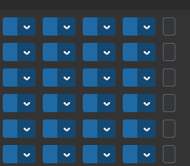

Не забудьте нажать кнопку "Сохранить" после всех действий.

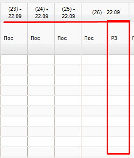

Одна особенность: оценка создается в самом последнем столбце выбранной даты.

### 8. Обновить таблицу

Данная функция как и в самом начале авторизации, заново обновляет список текущих групп. Актуально если со временем появятся новые группы.

### 9. Открыть окно для РП

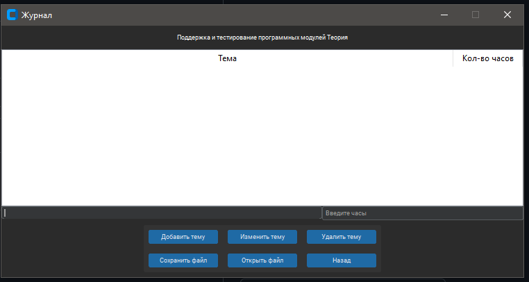

ПОТОМ НАПИШУ

### 10. Заполнить темы

Темы можно заполнить только после добавления их в предыдущем разделе. Они доступны только для выбранных групп.

---

Следуйте этой инструкции для успешного использования приложения LauncherSPO. Надеемся, она поможет вам с легкостью заполнять электронный журнал и вести учет явки и оценок для вашей группы.

Если вы встретили ошибки, мы с радостью их исправим.

Не бойтесь создавать `Issues`.

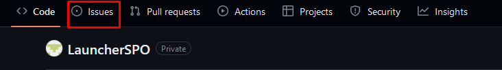
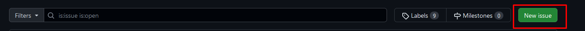

---
## v 0.9.2
- Добавлена возможность создавать несколько полей для оценки

## v 0.9.1

- Добавлено событие поиска по нажатию на enter
- Пишется инструкция
- Исправлено открытие занятий

## v 0.9.0

- Добавлена форма экзамена

## v 0.8.1

- Новый способ авторизации из-за защиты от DDoS-атак
- Добавлен скейлинг приложения для разных экранов

## v 0.8.0

- Добавлены внутренние функции для проверки открытых занятий и кол-во часов в общем
- Так же добавлен фильтр "Сегодня" для отображения пар на текущий день
- Внутренние оптимизации для плавной работы
- Исправлены некоторые ошибки с отображением групп и их выбором

## v 0.7.2

- Добавлено отображение имени группы у которой проверяете явку
- Добавлено отображение оставшихся часов(с цветовой индикацией)

## v 0.7.1

- Добавлено отображение средней оценки

## v 0.7.0

- Создано окно прогресса
- В тестовом режиме внедрено окно прогресса

## v 0.6.1

- Убраны группы "в" и обработано их автоматическое открытие с основной группой

## v 0.6.0

- В тестовом режиме добавлена загрузка тем
- Создание файлов для работы
