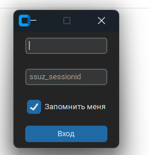

# LauncherSPO

Заполнение электронного журнала, отметка явки, выставление оценки
За основу [взято](https://github.com/ChePchik/Eljurnal)

img1.png

## Установка для пользователей

1. coming soon ...

## Установка для разработчиков

1. Скачиваем и устанавливаем [Python 3.10](https://www.python.org/downloads/release/python-3109/) (лучше) или 3.9.
2. Скачать проект любым способом. Открыть папку проекта
3. Открыть консоль в папке c проектом
4. Ввести команду `pip install -r requirements.txt` в консоль. Если нет ни каких ошибок - то можно продолжать дальше

# Инструкция использования

## 1. Запуск

Запускаем `LuncherSPO.exe` или `GUI.py`

У вас появится окно для авторизации

Вводите свои данные от электронного журнала.
_Свои данные можно сохранить, нажав кнопку, "Запомнить меня"_

Первый раз процесс будет не быстрым, это скачиваются и сохраняются ваши группы. Последующие разы будут быстрее.

## 2. Выбор действий

После автризации, у вас появляется главное меню и выбор некоторых действий. Давайте по ним пройдёмся.

### 1. Выбор теории или практики

### 2. Выбор группы и предмета

### 3. Панель поиска

Поиск происходит по целым словам, будь то курс или группа

### 4. Кнопка найти

После поиска нажимаете данную кнопку, либо нажимаете клавишу enter

### 5. Открыть занятие

### 6. Закрыть занятие

### 7. Проверить явку

### 8. Обновить таблицу

### 9. Открыть окно для РП

### 10. Заполнить темы

---

## v 0.9.0

- Добавлена форма экзамена
- Добавлено событие поиска по нажатию на enter

## v 0.8.1

- Новый способ авторизации из-за защиты от DDoS-атак
- Добавлен скейлинг приложения для разных экранов

## v 0.8.0

- Добавлены внутренние функции для проверки открытых занятий и кол-во часов в общем
- Так же добавлен фильтр "Сегодня" для отображения пар на текущий день
- Внутренние оптимизации для плавной работы
- Исправлены некоторые ошибки с отображением групп и их выбором

## v 0.7.2

- Добавлено отображение имени группы у которой проверяете явку
- Добавлено отображение оставшихся часов(с цветовой индикацией)

## v 0.7.1

- Добавлено отображение средней оценки

## v 0.7.0

- Создано окно прогресса
- В тестовом режиме внедрено окно прогресса

## v 0.6.1

- Убраны группы "в" и обработано их автоматическое открытие с основной группой

## v 0.6.0

- В тестовом режиме добавлена загрузка тем
- Создание файлов для работы
